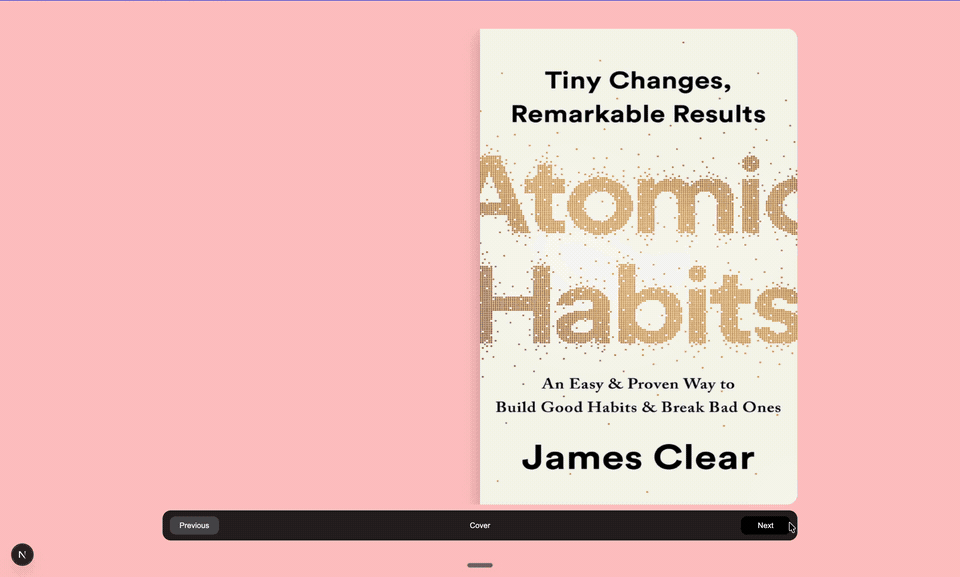

# Tama Book Reader

An interactive, responsive 2D flipbook built with Next.js, Tailwind CSS, and Motion. The reader recreates the feel of turning physical pages while keeping the content accessible and usable across desktop and mobile devices.

## Demo

### Desktop



## Features

- Realistic 3D page-turn animations
- Responsive single-page and two-page layouts
- Previous and next navigation through controls or page hotspots
- Reduced-motion support based on the user’s system preferences
- Reusable book configuration independent from the reader engine
- Support for real page images and generated placeholders
- Statically rendered Next.js entry page

## Tech Stack

- [Next.js 16](https://nextjs.org/) with the App Router
- [React 19](https://react.dev/)
- [Tailwind CSS 4](https://tailwindcss.com/)
- [Motion](https://motion.dev/) for page-turn animations
- TypeScript
- pnpm

## Getting Started

### Prerequisites

- Node.js 20 or later
- pnpm 10 or later

### Installation

```bash
git clone git@github.com:mariechristsagbo/tama-bookreader.git
cd tama-bookreader
pnpm install
```

### Development

```bash
pnpm dev
```

Open [http://localhost:3000](http://localhost:3000) in your browser.

## Available Scripts

| Command | Description |
| --- | --- |
| `pnpm dev` | Start the local development server |
| `pnpm build` | Create an optimized production build |
| `pnpm start` | Start the production server |
| `pnpm lint` | Run ESLint across the project |

## Project Structure

```text
app/
├── _components/flip-book/
│   ├── book-data.ts        # Book assets and content configuration
│   ├── book-model.ts       # Pure pagination and spread logic
│   ├── flip-book.tsx       # Reader state and orchestration
│   ├── turning-sheet.tsx   # Shared page-turn animation
│   └── ...                 # Surfaces, controls, and responsive helpers
├── globals.css             # Global styles and visual design tokens
├── layout.tsx              # Metadata and root layout
└── page.tsx                # Application entry page
public/book/                # Cover and page images
```

## Using Another Book

The reader receives a `BookDefinition`, so its content can be replaced without changing the animation or navigation components.

1. Add the cover and page assets to `public/book/`.
2. Update the definition in `app/_components/flip-book/book-data.ts`.
3. Keep the pages ordered in the `pages` array.
4. Update the accessible labels to describe the new book.

The navigation model supports both odd and even page counts.

## Quality Checks

Before opening a pull request, run:

```bash
pnpm lint
pnpm build
```
